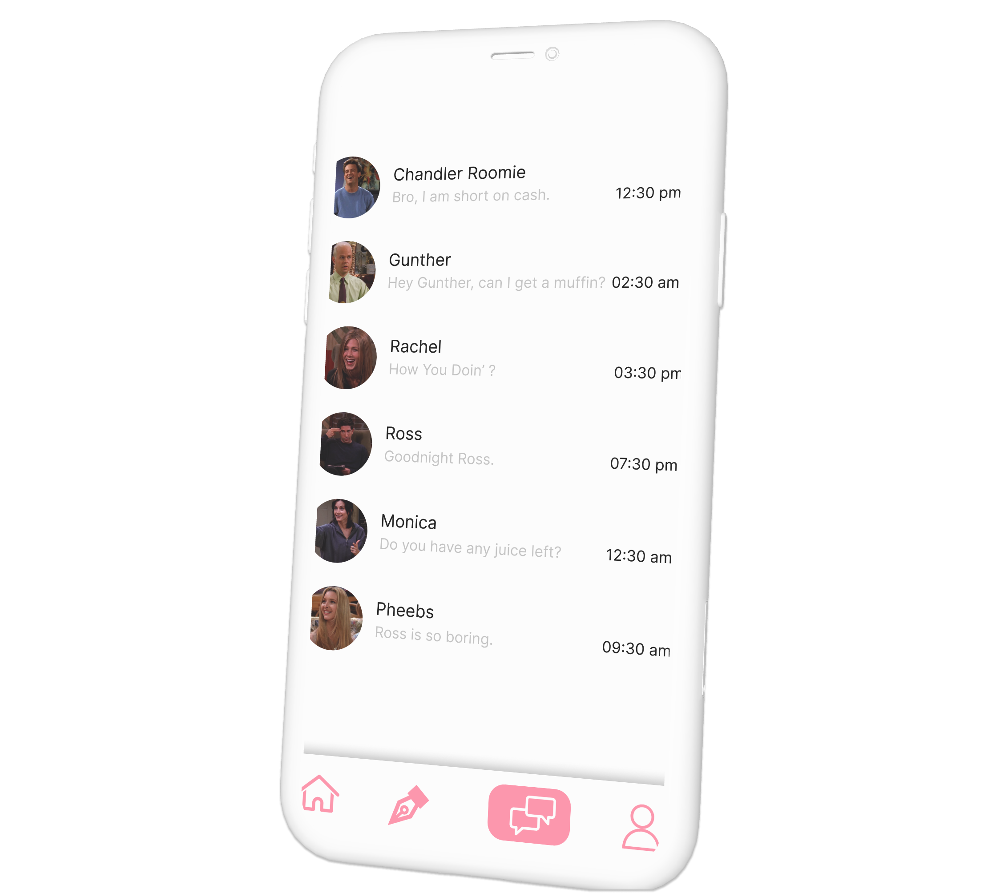

# Emo-Track

# 💻 Project Name
How You Doin'?
# 🚀 Tagline
**Improving Mental Health One Click at a Time!**
# 💡 The Problem it solves

Mental health is often an overlooked and stigmatized issue in many developing countries, in spite of its prevalence. According to a World Health Organisation (WHO) Report, major or minor mental illnesses requiring expert intervention is 7.5 per cent of India’s population. Also, estimates show that of roughly 60 million people with mental illnesses, about 90 per cent are currently not receiving treatment in India. The Covid-19 pandemic has highlighted the urgent need for reinvestment in mental health, as altered daily routines, financial pressures, extensive social isolation and information overload continues to take its toll on mental health.

Studies do show, however, that the population has begun to take mental health seriously, with 90% of survey respondents agreeing that mental health should be given as much consideration as physical health. Nonetheless, several physical and social infrastructural weaknesses in the system exist, resulting in:

1) **One in seven Indians** were affected by mental disorders of varying severity. The proportional contribution of mental disorders to the total disease burden in India has almost **doubled since 1990**. Substantial variations exist between states in the burden from different mental disorders and in their trends over time.

2) Many **mental health issues ending up getting detected and diagnosed too late**, leading to poorer outcomes and increased mortality, and

3) Patients who do end up seeking professional help end up with extremely infrequent appointments, due to India’s severe shortage of licensed psychiatrists (1 per 334,000 people). This leads to **patients having difficulty recounting what has happened since their last appointments**, and overworked **providers who may have difficulty keeping track of patient records.**

We witnessed a huge gap with the needs and the existing solutions hence, created **How You Doin'?**

# 💻 Brief Description of Product :

Our solution has two parts:
Web - application
Android application

We plan to develop these applications to create a seamless ecosystem for our users. These platforms allow the users to describe their feelings and with the help of our custom-built algorithm, we analyze their emotions from the description provided and calculate a mood index. Based on this mood index, we allow them to chat on our platform with people who have similar problems apart from this we also suggest relevant playlists, external audio rooms(Twitter spaces), etc. 

We also provide a graphical representation of the monthly/annual moods of the user in the form of graphs and pie charts.

# 🔨 Technologies Used :

- Python Libraries 
- Machine Learning Libraries 
- Flask 
- Flutter 
- Firebase 
- React 
- NextJS
- Styled components 
- HTML/CSS/JavaScript 
- Material UI
- SCSS 
- Figma

# 🧠 Challenges we ran into
• Time constraints, figuring out how to successfully incorporate all the features we wanted. 
• We were using Chrome Storage API for the first time and had a hard time figuring out it's functionalities

# 🏅 Accomplishments that we're proud of
We are proud that we are able to create a solution which can help our generation and anybody who are facing any problem with their mental health.

# 📖 What we learned
We being a team of inexperienced developers got to learn a lot about the nuances of JavaScript, Chrome Local Storage API and we also used SCSS for the first time in this project. This hackathon has given us a lot of exposure to the world of Web Development and creating practical solutions. 

# 🚀 What's next for *How You Doin'?*
• We plan to add Sentiment Analysis using Natural Language Processing to the mood description of the person. 
• We also plan to read the major problems from the mood description and provide the solution according to the most frequent problems.
